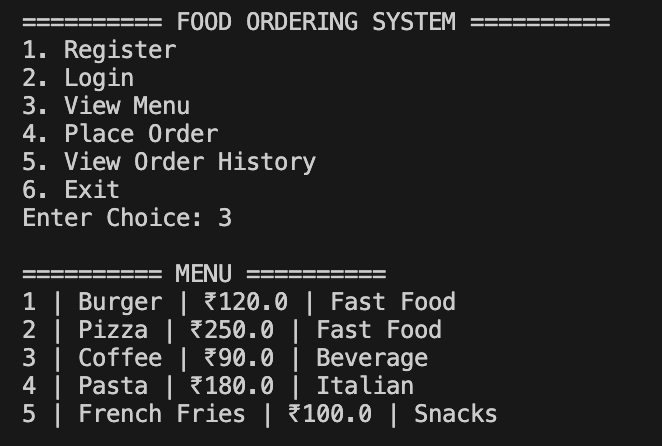
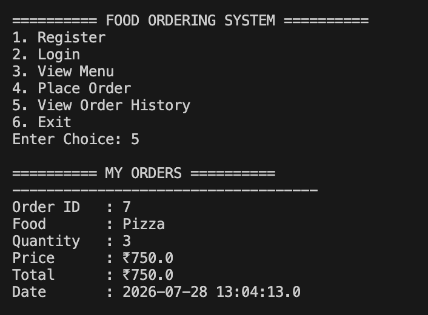

# 🍔 Online Food Ordering System

A Java-based console application that simulates an online food ordering system using **Java**, **JDBC**, and **MySQL**. The project allows users to register, log in, browse the menu, place food orders, and view their order history. It follows Object-Oriented Programming (OOP) principles and uses the DAO (Data Access Object) design pattern for database operations.

---

## 📌 Features

- 👤 User Registration
- 🔐 User Login
- 🍽️ View Food Menu
- 🛒 Place Food Orders
- 💰 Automatic Bill Calculation
- 📜 View Order History
- 🗄️ MySQL Database Integration
- 📦 Order & Order Item Management
- ⚡ Exception Handling
- 🧩 Modular Project Structure using DAO Pattern

---

## 🛠️ Tech Stack

- Java 17
- JDBC
- MySQL 8
- Git & GitHub
- VS Code

---

## 📂 Project Structure

```
Online-Food-Ordering-System
│
├── lib
│   └── mysql-connector-j-9.7.0.jar
│
├── sql
│   └── database.sql
│
├── src
│   ├── app
│   │   └── Main.java
│   │
│   ├── dao
│   │   ├── UserDAO.java
│   │   ├── MenuDAO.java
│   │   └── OrderDAO.java
│   │
│   ├── database
│   │   └── DBConnection.java
│   │
│   ├── model
│   │   ├── User.java
│   │   ├── Order.java
│   │   ├── MenuItem.java
│   │   └── CartItem.java
│   │
│   └── service
│       └── FoodOrderingService.java
│
└── README.md
```

---

## 🗄️ Database Schema

The application uses four main tables:

### Users

| Column | Type |
|---------|------|
| id | INT |
| name | VARCHAR |
| email | VARCHAR |
| password | VARCHAR |

### Menu

| Column | Type |
|---------|------|
| id | INT |
| food_name | VARCHAR |
| price | DECIMAL |
| category | VARCHAR |

### Orders

| Column | Type |
|---------|------|
| order_id | INT |
| user_id | INT |
| total | DECIMAL |
| order_date | TIMESTAMP |

### Order Items

| Column | Type |
|---------|------|
| id | INT |
| order_id | INT |
| food_id | INT |
| quantity | INT |
| price | DECIMAL |

---

## 🚀 How to Run

### 1. Clone the Repository

```bash
git clone git@github.com:lalitmalik321-pixel/Online-Food-Ordering-System.git
```

### 2. Open the Project

Open the project in VS Code.

### 3. Create Database

```sql
CREATE DATABASE food_ordering;
```

Run the SQL script available in:

```
sql/database.sql
```

### 4. Update Database Credentials

Edit:

```
src/database/DBConnection.java
```

Set your MySQL username and password.

### 5. Compile

```bash
cd src

javac -cp "../lib/mysql-connector-j-9.7.0.jar:." app/*.java dao/*.java database/*.java model/*.java service/*.java
```

### 6. Run

```bash
java -cp ".:../lib/mysql-connector-j-9.7.0.jar" app.Main
```

---

## 💻 Sample Output

```
========== FOOD ORDERING SYSTEM ==========
1. Register
2. Login
3. View Menu
4. Place Order
5. View Order History
6. Exit
```

---

## 🎯 Concepts Used

- Object-Oriented Programming (OOP)
- JDBC Connectivity
- MySQL
- CRUD Operations
- DAO Design Pattern
- PreparedStatement
- SQL Joins
- Exception Handling
- Menu-Driven Programming

---

## 📈 Future Enhancements

- Shopping Cart
- Admin Dashboard
- Online Payment Integration
- Email Notifications
- Spring Boot REST API
- React Frontend
- JWT Authentication
- Docker Deployment

---

## 📷 Screenshots

Add screenshots in a folder named `screenshots`.

Example:

```
screenshots/
├── main-menu.png
├── login.png
├── menu.png
├── order.png
└── history.png
```

Then display them in the README:

```md
### Main Menu


### Food Menu



### Order History


```

---

## 👨‍💻 Author

**Lalit Malik**

- GitHub: https://github.com/lalitmalik321-pixel
- LinkedIn: (https://www.linkedin.com/in/lalit-singh-malik-25a09a3a7)

---

## ⭐ If you like this project

If you found this project helpful, consider giving it a ⭐ on GitHub.

---

## 📄 License

This project is developed for learning and educational purposes.1
